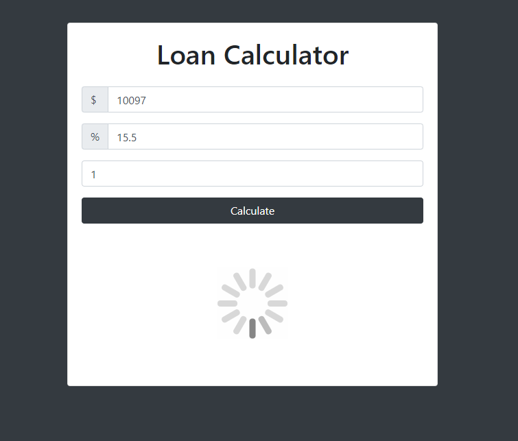

# WEB-MINI-PROJECTS

## <a href="https://ilyakozak.github.io/web-mini-projects/loan-calculator">Loan Calculator</a>  
###### <a href="https://github.com/IlyaKozak/web-mini-projects/tree/master/loan-calculator">github</a>  
 
===> based on https://www.udemy.com/modern-javascript-from-the-beginning/
##

## <a href="https://ilyakozak.github.io/web-mini-projects/task-list">Task List</a> 
###### <a href="https://github.com/IlyaKozak/web-mini-projects/tree/master/task-list">github</a>  
 
===> based on https://www.udemy.com/modern-javascript-from-the-beginning/
##

## <a href="https://ilyakozak.github.io/web-mini-projects/number-guesser">Number Guesser</a> 
###### <a href="https://github.com/IlyaKozak/web-mini-projects/tree/master/number-guesser">github</a>  
 
===> based on https://www.udemy.com/modern-javascript-from-the-beginning/
##

## <a href="https://ilyakozak.github.io/web-mini-projects/flex-panels-image-gallery">Flex Panels Image Gallery</a> 
###### <a href="https://github.com/IlyaKozak/web-mini-projects/tree/master/flex-panels-image-gallery">github</a>  
 
===> based on https://javascript30.com/
##

## <a href="https://ilyakozak.github.io/web-mini-projects/usa-cities">USA Cities/States Search</a> 
###### <a href="https://github.com/IlyaKozak/web-mini-projects/tree/master/usa-cities">github</a>  
 
===> based on https://javascript30.com/
##

## <a href="https://ilyakozak.github.io/web-mini-projects/chuck-norris-project">Chuck Norris Jokes Generator</a> 
###### <a href="https://github.com/IlyaKozak/web-mini-projects/tree/master/chuck-norris-project">github</a>  
 
===> based on https://www.udemy.com/modern-javascript-from-the-beginning/
##
